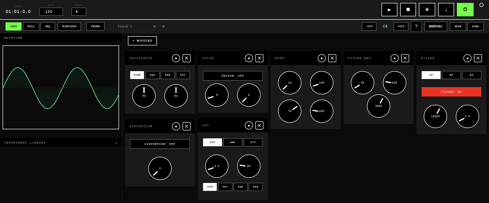

# FractInst - Browser-Based Modular Synthesizer & DAW

[](https://opensource.org/licenses/MIT)
[](https://isaacamar.github.io/fractinst/)
[](https://buymeacoffee.com/YOUR_USERNAME)
[](https://github.com/sponsors/YOUR_USERNAME)

> A powerful, low-latency browser-based digital audio workstation (DAW) and modular synthesizer. No installation required—create music directly in your browser.

**[Try Live Demo](https://isaacamar.github.io/fractinst/)** • **[Read the Manual](https://isaacamar.github.io/fractinst/manual)** • **[Join Community](#community)** • **[Support Development](#support-this-project)**



---

## Features

### Modular Synthesis Engine
- **32-voice polyphony** for complex arrangements
- **Multiple waveforms**: Sine, Square, Sawtooth, Triangle
- **Complete ADSR envelope** with millisecond precision
- **Multi-mode filter**: Lowpass, Highpass, Bandpass with resonance
- **Filter envelope** for dynamic timbre evolution
- **LFO modulation** with multiple waveforms and targets
- **Voice module** with unison/detune and noise generator

### Professional Effects
- **Distortion** - Waveshaper-based saturation
- **Compressor** - Dynamic range control
- **Chorus** - Stereo width and shimmer
- **Delay** - Tempo-synced echoes with feedback
- **Reverb** - Convolution-based room ambience
- All effects feature **true bypass** for zero CPU when disabled

### Drum Machine & Sequencer
- **10 drum sounds per kit** (Kick, Snare, Clap, Hi-Hats, Toms, Cymbals)
- **Multiple drum kits**: TR-909, BVKER
- **Grid-based step sequencer** with adjustable steps and resolution
- **Pattern presets** with save/load functionality
- **Pattern freezing** for CPU optimization
- Keyboard triggering and real-time performance

### DAW Capabilities
- **Piano Roll editor** with drag-and-drop MIDI editing
- **Multi-track system** with unlimited tracks
- **Arrangement view** with timeline and clips
- **MIDI recording** with metronome and count-in
- **Transport controls**: Play, Stop, Record, Loop
- **Adjustable BPM** (20-300) and loop length
- **Per-track controls**: Volume, Pan, Mute, Solo

### Performance Features
- **QWERTY keyboard** becomes a piano (A-K keys)
- **Chord mode** with 13 chord types on number keys
- **Percussion mode** with drum triggering
- **Octave switching** (0-8 range)
- **Keyboard shortcuts** for transport and navigation

### Visualization
- **Real-time oscilloscope** with phase alignment
- **Separate drum oscilloscope** for percussion visualization
- **Waveform smoothing** and frequency detection

### Preset Management
- **Instrument Library** with save/load
- **Full patch export** (all modules + effects)
- **Drum pattern presets** (4 built-in + custom)
- **LocalStorage persistence** - your work is saved automatically

---

## Quick Start

### Option 1: Use Online (No Installation)
Simply visit **[https://isaacamar.github.io/fractinst/](https://isaacamar.github.io/fractinst/)** and start making music!

### Option 2: Run Locally

#### Prerequisites
- Node.js 18+ and npm

#### Installation
```bash
# Clone the repository
git clone https://github.com/isaacamar/fractinst.git
cd fractinst

# Install dependencies
npm install

# Start development server
npm run dev

# Build for production
npm run build
```

The app will be available at `http://localhost:5173`

---

## How to Use

### Basic Workflow
1. **Play notes** - Use A-K keys for piano, W/E/T/Y/U for sharps/flats
2. **Design sounds** - Click `INST` to access the modular synth
3. **Create beats** - Click `SEQ` for the drum sequencer
4. **Record melodies** - Click `ROLL` and hit Record to capture MIDI
5. **Manage tracks** - Use the track selector to build arrangements

### Keyboard Shortcuts
- `Space` - Play/Stop
- `R` - Record
- `-` / `=` - Octave down/up
- `1-9` - Trigger chords (customizable)
- Click `BINDINGS` button for full list

For detailed tutorials and complete documentation, see **[the manual](https://isaacamar.github.io/fractinst/manual)**.

---

## Tech Stack

- **[React 18](https://react.dev/)** - UI framework
- **[TypeScript](https://www.typescriptlang.org/)** - Type safety
- **[Vite](https://vitejs.dev/)** - Build tool and dev server
- **[Zustand](https://github.com/pmndrs/zustand)** - State management
- **[Web Audio API](https://developer.mozilla.org/en-US/docs/Web/API/Web_Audio_API)** - Real-time audio processing
- **[React Router](https://reactrouter.com/)** - Navigation
- **[Driver.js](https://driverjs.com/)** - Interactive onboarding
- **[IndexedDB](https://developer.mozilla.org/en-US/docs/Web/API/IndexedDB_API)** - Local storage

No external audio libraries—everything is built on native Web Audio API for maximum performance.

---

## Project Structure

```
fractinst/
├── src/
│   ├── components/        # React components
│   │   ├── Manual/        # In-app documentation
│   │   ├── ModuleSystem/  # Synth modules
│   │   ├── Oscilloscope/  # Visualizations
│   │   ├── PianoRoll/     # MIDI editor
│   │   ├── StepSequencer/ # Drum sequencer
│   │   └── ...
│   ├── engines/           # Audio engines
│   │   ├── AudioEngine.ts # Main synth engine
│   │   ├── DAWCore.ts     # Transport & recording
│   │   ├── DrumMachine.ts # Sample playback
│   │   └── ...
│   ├── stores/            # Zustand state stores
│   ├── hooks/             # Custom React hooks
│   ├── types/             # TypeScript definitions
│   └── utils/             # Helper functions
├── public/
│   └── samples/           # Drum samples (TR-909, BVKER)
└── docs/                  # Additional documentation
```

---

## Contributing

Contributions are welcome! Whether it's bug reports, feature requests, or code contributions, all are appreciated.

Please see **[CONTRIBUTING.md](CONTRIBUTING.md)** for guidelines.

### Ways to Contribute
- Report bugs via [GitHub Issues](https://github.com/isaacamar/fractinst/issues)
- Suggest features or improvements
- Improve documentation
- Design presets or demo songs
- Submit pull requests

---

## Support This Project

FractInst is **free and open source**. If you find it useful, consider supporting continued development:

- **[Buy me a coffee](https://buymeacoffee.com/YOUR_USERNAME)**
- **[Sponsor on GitHub](https://github.com/sponsors/YOUR_USERNAME)**
- **Star this repository** to help others discover it

Every bit of support helps maintain and improve FractInst!

---

## License

This project is licensed under the **MIT License** - see the [LICENSE](LICENSE) file for details.

### Third-Party Assets
- **TR-909 samples**: Public domain
- **BVKER 909 Kit**: [Attribution required - see CREDITS.md](CREDITS.md)

See **[CREDITS.md](CREDITS.md)** for full attributions.

---

## Roadmap

### Planned Features
- [ ] Export to WAV/MP3
- [ ] MIDI file import/export
- [ ] VST-style plugin system
- [ ] Cloud project sync
- [ ] Mobile/touch optimization
- [ ] Additional drum kits
- [ ] More effects (phaser, flanger, EQ)
- [ ] Automation lanes
- [ ] Sample editor

See [GitHub Issues](https://github.com/isaacamar/fractinst/issues) for full list and vote on features!

---

## Community

- **GitHub Discussions**: [Ask questions & share creations](https://github.com/isaacamar/fractinst/discussions)
- **Discord**: [Join the community](#) (Coming soon)
- **Twitter**: [@YOUR_TWITTER](#)
- **Email**: your.email@example.com

---

## Acknowledgments

- Built by **Isaac Amar**
- Developed with assistance from various generative models - see [CREDITS.md](CREDITS.md) for details
- Inspired by classic synthesizers (Moog, Roland TB-303, TR-909)
- Thanks to the Web Audio API community and all contributors

---

## Stats


---

**Made with Love and Web Audio API**

[Back to top](#fractinst---browser-based-modular-synthesizer--daw)
